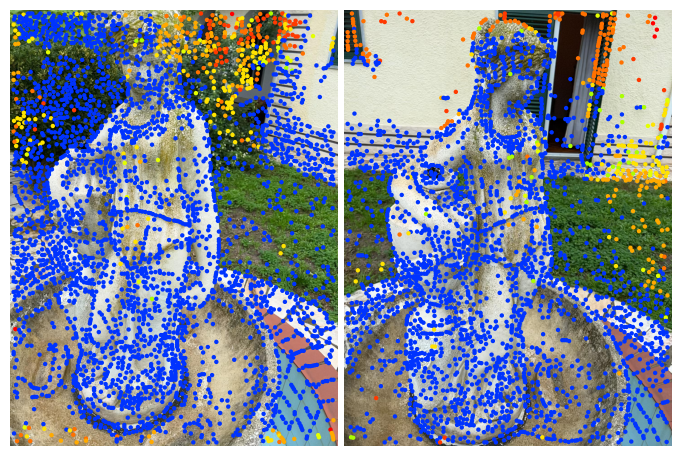
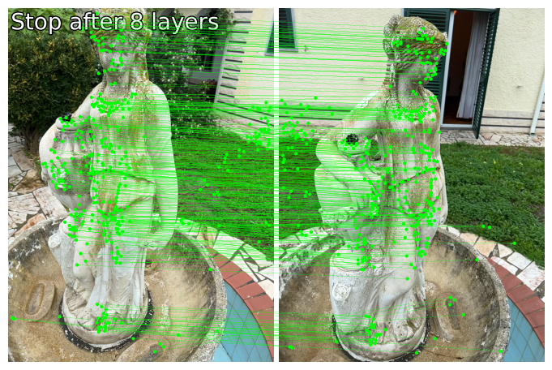
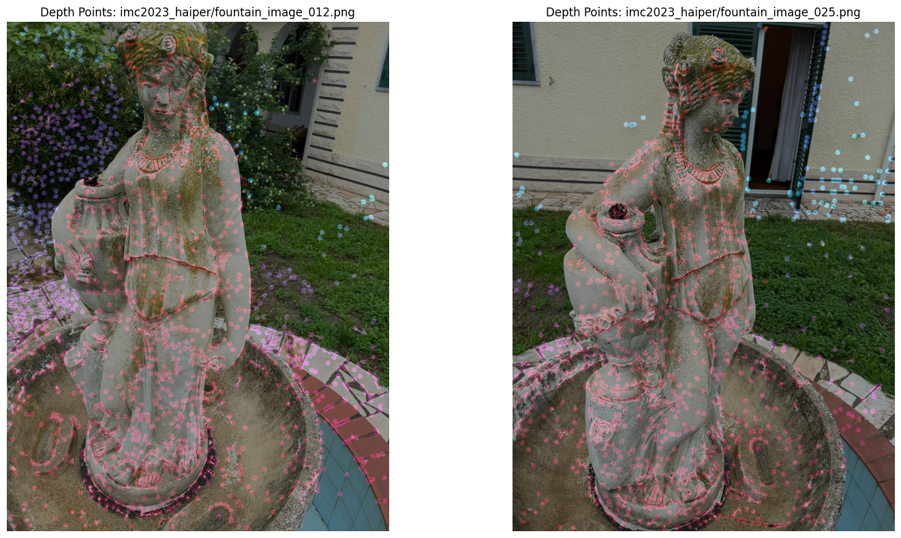
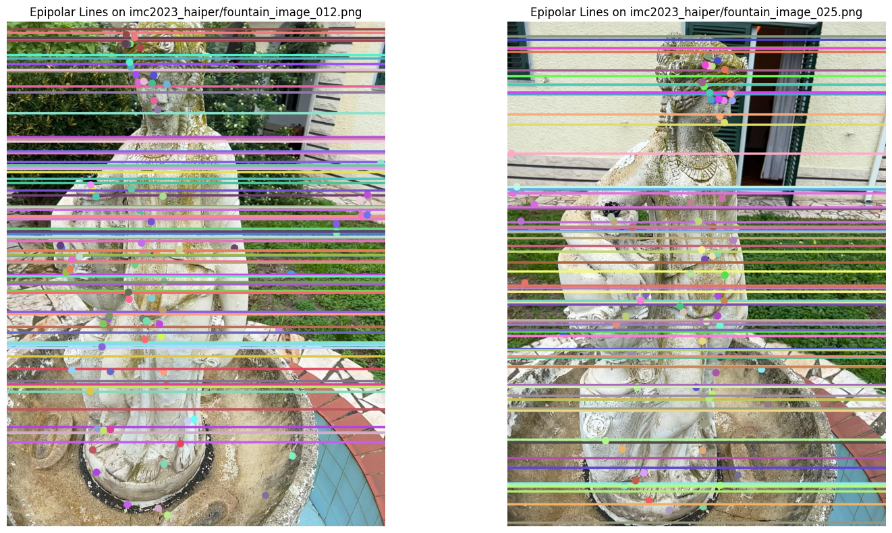

# Image Matching Challenge 2025 – Modular SfM Pipeline

## Overview
This repository implements a modular pipeline for the IMC 2025 Image Matching Challenge, integrating global image clustering, local keypoint matching, and Structure from Motion(SfM) reconstruction.

## Pipeline Overview

- **Global Descriptor Extraction**: DINOv2 ViT features
- **Clustering**: FAISS k-NN + Louvain community detection
- **Keypoint Detection**: SuperPoint
- **Matching**: LightGlue
- **Geometric Validation**: COLMAP SfM with triangulation
- **Threshold Filtering**: Uses scene-specific values from `train_thresholds.csv`

## Features
- Global image grouping with DINOv2 and FAISS
- Robust local feature matching via SuperPoint and LightGlue
- COLMAP-compatible keypoint, match, and descriptor database generation
- SfM-based camera pose and 3D structure recovery

## Geometric Diagnostics (Step 4)
Visualizations from the reconstruction and matching stages:

### Keypoint Detection

- Blue: retained keypoints  
- Other colors: pruned keypoints

### Matched Keypoints Across Views

Green lines show LightGlue matches later validated by COLMAP triangulation.

### Reprojected Triangulated Depth Points

Triangulated 3D points projected into the original views for verification.
- Closer points → cool colors (purple/blue)
- Farther points → warm colors (red/yellow)

### Epipolar Line Consistency

Epipolar constraints derived from the fundamental matrix overlaid on image pairs.

## Dataset Used
- https://www.kaggle.com/competitions/image-matching-challenge-2025/data

## References
- [COLMAP](https://colmap.github.io)
- [LightGlue](https://github.com/cvg/LightGlue)
- [DINOv2](https://github.com/facebookresearch/dinov2)
- [IMC 2025 Utilities](https://www.kaggle.com/datasets/eduardtrulls/imc25-utils)
- [CS231A: Computer Vision from 3D Reconstruction to Recognition (Stanford)](https://web.stanford.edu/class/cs231a/course_notes.html)
- Leroy, Vincent, Yohann Cabon, and Jérôme Revaud. "Grounding image matching in 3d with mast3r." In European Conference on Computer Vision, pp. 71-91. Cham: Springer Nature Switzerland, 2024.
- Murez, Zak, Tarrence Van As, James Bartolozzi, Ayan Sinha, Vijay Badrinarayanan, and Andrew Rabinovich. "Atlas: End-to-end 3d scene reconstruction from posed images." In European conference on computer vision, pp. 414-431. Cham: Springer International Publishing, 2020.

